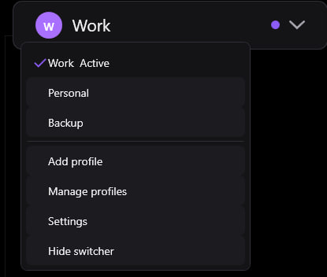
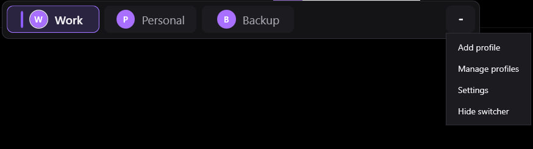

<div align="center">

# Codex Swap Account

**A safe, local Windows account switcher for the Codex desktop app.**

Switch between multiple Codex accounts from an overlay attached directly to the Codex window — with tray controls, global hotkeys, shared chats/settings, multi-monitor support, and automatic rollback if a switch fails.

[](https://github.com/ZOONGG/codex-swap-account)
[](https://dotnet.microsoft.com/)
[](https://github.com/ZOONGG/codex-swap-account/actions/workflows/windows-ci.yml)
[](https://github.com/ZOONGG/codex-swap-account/releases/latest)
[](LICENSE)
[](#privacy-and-security)

[Download latest release](https://github.com/ZOONGG/codex-swap-account/releases/latest) ·
[Report a bug](https://github.com/ZOONGG/codex-swap-account/issues/new?template=bug_report.md) ·
[Request a feature](https://github.com/ZOONGG/codex-swap-account/issues/new?template=feature_request.md)

<p align="center">
  <strong>English</strong> ·   <a href="README_RU.md">Русский</a>
</p>

</div>

<p align="center">
  
</p>

> [!IMPORTANT]
> Codex Swap Account is an **unofficial community tool**. It is not affiliated with, endorsed by, or sponsored by OpenAI.  
> Never publish, upload, or commit your `auth.json` files.

---

## Why this exists

Using several Codex accounts normally means repeatedly signing out, opening a browser, completing authentication, and restarting your workflow.

Codex Swap Account turns that into a one-click action:

1. choose a profile in the overlay, tray menu, or with a hotkey;
2. the app safely saves the current profile state;
3. Codex restarts with the selected account;
4. your projects, chats, settings, history, and local workspace stay shared.

The app runs quietly in the system tray and only shows the overlay when a verified Codex window is available.

## Highlights

| | Feature |
|---|---|
| **Fast switching** | Switch accounts from the overlay, tray menu, or `Ctrl + Alt + 1…9`. |
| **Shared workspace** | Keep the same Codex chats, projects, settings, history, caches, and databases across accounts. |
| **Compact and expanded modes** | Use a minimal dropdown or a one-click segmented profile bar. |
| **Safe transaction** | Back up the active authorization and automatically roll back if switching fails. |
| **Multi-monitor ready** | The overlay follows Codex across monitors, window moves, resizes, and DPI changes. |
| **Local only** | No telemetry, no cloud sync, no reverse proxy, and no credential upload. |
| **Tray companion** | Launch Codex, show/hide the overlay, manage profiles, and change settings from the tray. |
| **Bilingual UI** | English and Russian interface support. |
| **No admin rights** | Runs per-user and does not require a Windows service. |
| **Open source** | Built with C#, .NET 8, WPF, and a security-focused repository workflow. |

## Screenshots

### Expanded mode

Switch profiles instantly with one click.

<p align="center">
  
</p>

### Compact mode

A smaller control with a dropdown for profiles and common actions.

<p align="center">
  
</p>

### Profile menu

Add profiles, open profile management, change settings, or hide the switcher.

<p align="center">
  
</p>

### Appearance settings

Choose the display mode, position, scale, and animation behavior.

<p align="center">
  
</p>

### Profile management

Create, organize, and manage local Codex profiles.

<p align="center">
  
</p>

---

## Download

Go to the [latest GitHub release](https://github.com/ZOONGG/codex-swap-account/releases/latest).

Recommended download:

```text
CodexProfileOverlay-win-x64-portable.zip
```

Standalone executable:

```text
CodexProfileOverlay.exe
```

Integrity hashes:

```text
SHA256SUMS.txt
```

### Requirements

- Windows 10 or Windows 11
- x64 system
- Codex desktop app
- Codex CLI available in `PATH` when adding a new profile

> [!NOTE]
> Windows SmartScreen may warn about an unsigned executable. This is expected for an independently distributed open-source build. Verify the SHA-256 hash from the release and review/build the source if you prefer.

## Quick start

1. Download `CodexProfileOverlay-win-x64-portable.zip`.
2. Extract the archive to a normal folder.
3. Run `CodexProfileOverlay.exe`.
4. Open Codex.
5. Use **Add profile** to authorize your accounts.
6. Select a profile from the overlay, tray menu, or a hotkey.

The application remains in the system tray. Closing the settings window does not exit the background process.

### Русский — быстрый старт

<details>
<summary>Открыть инструкцию</summary>

1. Скачайте `CodexProfileOverlay-win-x64-portable.zip` из раздела [Releases](https://github.com/ZOONGG/codex-swap-account/releases/latest).
2. Распакуйте архив.
3. Запустите `CodexProfileOverlay.exe`.
4. Откройте Codex.
5. Нажмите **Добавить профиль** и войдите в нужные аккаунты.
6. Переключайтесь через панель, меню в трее или горячие клавиши.

Приложение работает локально, не отправляет токены и сохраняет общими ваши чаты, проекты и настройки Codex.

</details>

## Default hotkeys

| Action | Default shortcut |
|---|---|
| Show or hide the overlay | `Ctrl + Alt + C` |
| Switch to profile 1 | `Ctrl + Alt + 1` |
| Switch to profile 2 | `Ctrl + Alt + 2` |
| Switch to profile 3 | `Ctrl + Alt + 3` |
| Switch to profiles 4–9 | `Ctrl + Alt + 4…9` |

Hotkeys can be changed or cleared in **Settings → Hotkeys**. The app reports a conflict when Windows cannot register a shortcut.

## How switching works

Codex normally stores local state under:

```text
%USERPROFILE%\.codex
```

Codex Swap Account keeps that directory shared between all profiles so your local environment remains consistent:

```text
%USERPROFILE%\.codex
├── chats / sessions
├── projects
├── settings
├── history
├── caches
├── databases
└── auth.json        ← only this file is switched
```

Saved account profiles are stored separately:

```text
%USERPROFILE%\.codex-profiles
├── Work
│   └── auth.json
├── Personal
│   └── auth.json
└── Backup
    └── auth.json
```

During a switch, the app:

1. prevents concurrent switch operations;
2. closes Codex gracefully;
3. saves the freshly updated shared `auth.json` back to the active profile;
4. creates a backup of the current shared authorization;
5. atomically replaces the shared `auth.json` with the selected profile;
6. records the active profile only after replacement succeeds;
7. launches Codex normally;
8. restores the previous authorization if any critical step fails.

The application does **not** switch the entire `.codex` directory. That is why Codex settings, chats, projects, and local history remain available after changing accounts.

## Adding a profile

The **Add profile** flow:

1. creates a directory under `%USERPROFILE%\.codex-profiles`;
2. creates a profile-local `config.toml` when required;
3. runs `codex login` with `CODEX_HOME` set only for that login process;
4. waits for browser authentication;
5. checks that the profile authorization file exists;
6. adds the profile to the switcher.

The app never displays or logs the credential contents.

## Display modes

### Auto

Uses Expanded mode when enough space is available and Compact mode for narrow Codex windows. Hysteresis prevents mode flickering during resizing.

### Expanded

Shows all profiles as segmented buttons for immediate one-click switching.

### Compact

Shows the active profile in a smaller dropdown with access to profiles and common actions.

The overlay can be positioned after the Codex menu, centered, aligned right, or dragged to a custom location with `Alt + left mouse button`.

## System tray

The tray menu provides:

- Open Codex
- Show or hide the switcher
- Switch profiles
- Open Settings
- Enable or disable Start with Windows
- Exit the application

The tray process stays alive when Codex is closed or minimized and automatically reattaches when Codex becomes available again.

## Privacy and security

Codex Swap Account is designed to operate entirely on the local machine.

- no telemetry;
- no analytics;
- no remote account database;
- no credential upload;
- no browser-cookie export;
- no reverse proxy;
- no Windows service;
- no administrator privileges;
- no parsing, printing, or logging of `auth.json` contents.

Local application data is stored under:

```text
%LOCALAPPDATA%\CodexProfileOverlay
```

This may contain non-secret settings, logs, backups, profile display metadata, and removed-profile backups.

Read the complete security policy in [SECURITY.md](SECURITY.md).

> [!WARNING]
> Treat every `auth.json` file like a password. Never share it, attach it to an issue, or commit it to Git.

## Installation options

### Portable

Download the portable ZIP, extract it, and run:

```powershell
.\CodexProfileOverlay.exe
```

### Per-user installation from source

```powershell
.\install.ps1 -Launch
```

Enable Start with Windows during installation:

```powershell
.\install.ps1 -StartWithWindows -Launch
```

Default installation location:

```text
%LOCALAPPDATA%\CodexProfileOverlay
```

## Uninstall

From the repository:

```powershell
.\uninstall.ps1
```

The uninstaller removes the application, its shortcuts, and its startup entry. It does **not** remove:

- `%USERPROFILE%\.codex`;
- `%USERPROFILE%\.codex-profiles`;
- Codex chats;
- Codex projects;
- Codex settings;
- Codex history;
- account authorization files.

## Build from source

### Prerequisites

- Windows 10/11 x64
- PowerShell 5.1 or later
- .NET 8 SDK

Clone the repository:

```powershell
git clone https://github.com/ZOONGG/codex-swap-account.git
cd codex-swap-account
```

Run tests:

```powershell
.\test.ps1
```

Build Release:

```powershell
.\build.ps1
```

Run the repository safety scan:

```powershell
.\verify-repository-safety.ps1
```

Publish the self-contained Windows build:

```powershell
.\publish.ps1
```

Output:

```text
artifacts\publish\CodexProfileOverlay.exe
artifacts\CodexProfileOverlay-win-x64-portable.zip
```

## Repository structure

```text
.
├── .github/                         GitHub Actions and templates
├── docs/                            Architecture, privacy, and screenshots
├── src/
│   ├── CodexProfileOverlay/         WPF desktop application
│   └── CodexProfileOverlay.Core/    Profiles, settings, switching, safety
├── tests/
│   └── CodexProfileOverlay.Tests/   Unit tests with fake credentials
├── build.ps1
├── test.ps1
├── publish.ps1
├── install.ps1
├── uninstall.ps1
└── verify-repository-safety.ps1
```

## Troubleshooting

### Codex is not detected

- Make sure the official Codex desktop app is open.
- Restart Codex Swap Account.
- Check the logs under `%LOCALAPPDATA%\CodexProfileOverlay\logs`.
- Verify that Codex can be started normally.

### The overlay is hidden

- Press `Ctrl + Alt + C`.
- Left-click the tray icon.
- Use **Show switcher** from the tray menu.
- Check **Show automatically when Codex opens** in Settings.

### A hotkey does not work

Another application may already own that shortcut. Open **Settings → Hotkeys** and choose a different combination.

### A profile cannot send requests

The stored login may have expired or been revoked. Remove/re-add the local profile or authenticate it again through the Add profile flow.

### Windows SmartScreen blocks the app

Choose **More info → Run anyway** only after downloading from the official repository release and verifying the SHA-256 hash.

## Limitations

- Windows x64 only.
- Switching requires Codex to restart so it can load the selected authorization.
- Adding profiles requires the Codex CLI.
- The current installer is a per-user PowerShell installer rather than MSI/MSIX.
- The application depends on window/process metadata available to a normal Windows user process.

## Contributing

Contributions are welcome.

Before opening a pull request:

1. read [CONTRIBUTING.md](CONTRIBUTING.md);
2. keep credential files and local user data out of Git;
3. run `.\test.ps1`;
4. run `.\build.ps1`;
5. run `.\verify-repository-safety.ps1`;
6. describe manual UI verification where relevant.

Use [GitHub Issues](https://github.com/ZOONGG/codex-swap-account/issues) for reproducible bugs and focused feature requests.

## License

Distributed under the [MIT License](LICENSE).

## Disclaimer

Codex Swap Account is an unofficial community project and is not affiliated with, endorsed by, or sponsored by OpenAI.

OpenAI and Codex are trademarks of their respective owner. This project provides a local companion interface and does not modify the official Codex installation.
