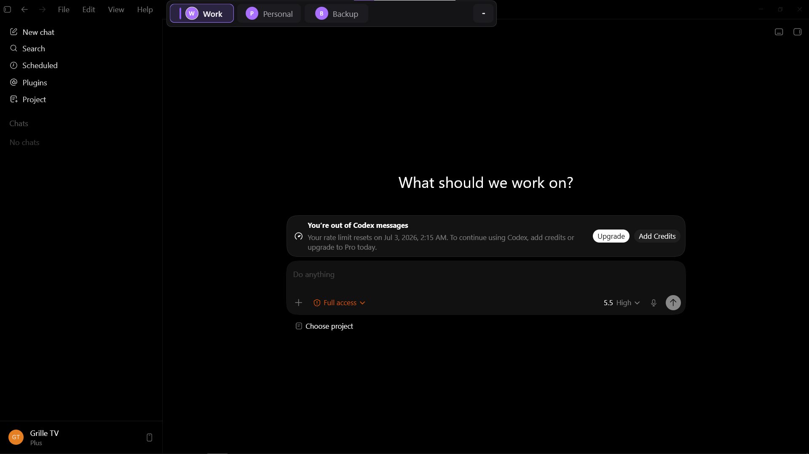
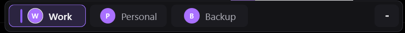
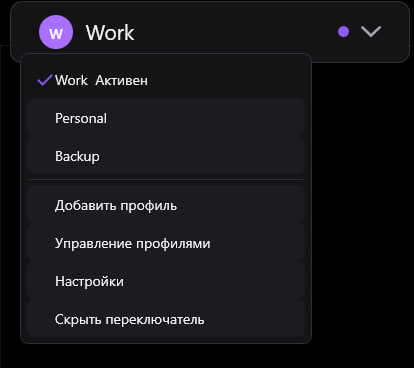
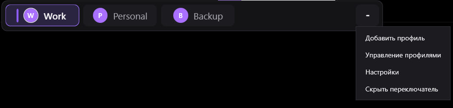
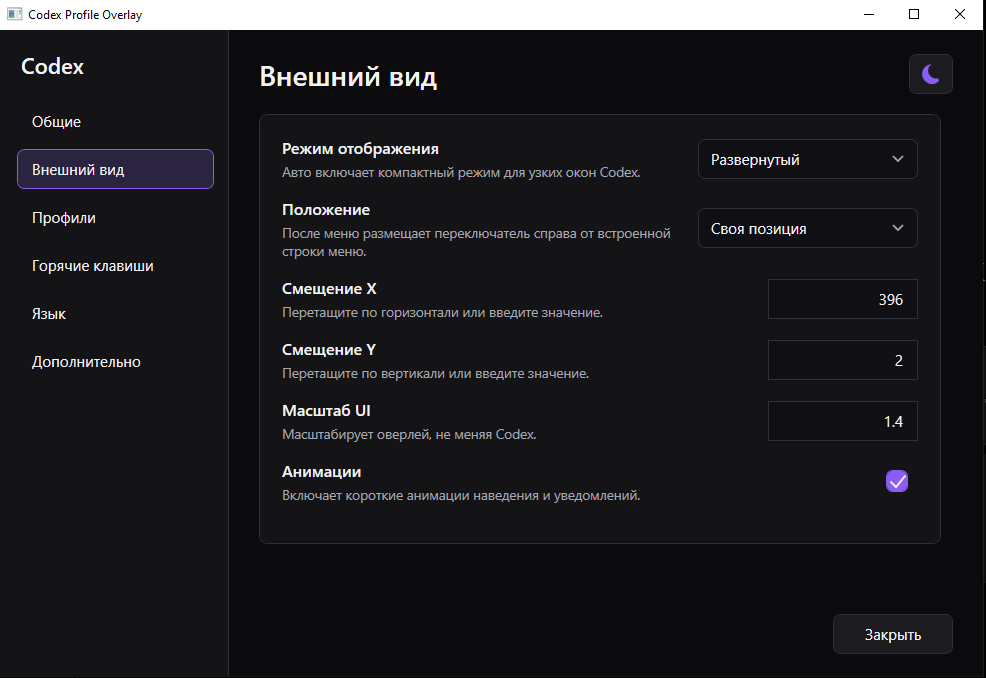
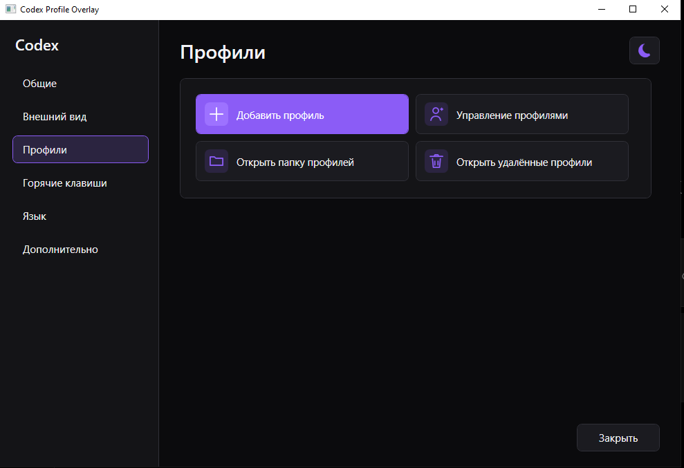

<div align="center">

# Codex Swap Account

**Безопасный локальный переключатель аккаунтов для Codex Desktop на Windows.**

Переключайтесь между несколькими аккаунтами Codex через панель прямо в окне приложения — с управлением из трея, глобальными горячими клавишами, общими чатами и настройками, поддержкой нескольких мониторов и автоматическим откатом при ошибке.

[](https://github.com/ZOONGG/codex-swap-account)
[](https://dotnet.microsoft.com/)
[](https://github.com/ZOONGG/codex-swap-account/actions/workflows/windows-ci.yml)
[](https://github.com/ZOONGG/codex-swap-account/releases/latest)
[](LICENSE)
[](#конфиденциальность-и-безопасность)

[Скачать последнюю версию](https://github.com/ZOONGG/codex-swap-account/releases/latest) ·
[Сообщить об ошибке](https://github.com/ZOONGG/codex-swap-account/issues/new?template=bug_report.md) ·
[Предложить функцию](https://github.com/ZOONGG/codex-swap-account/issues/new?template=feature_request.md)

<p align="center">
  <a href="README.md">English</a> ·
  <strong>Русский</strong>
</p>

</div>

<p align="center">
  
</p>

> [!IMPORTANT]
> Codex Swap Account — **неофициальный инструмент сообщества**. Проект не связан с OpenAI, не поддерживается и не одобряется OpenAI.  
> Никогда не публикуйте, не отправляйте и не добавляйте в Git файлы `auth.json`.

---

## Зачем это нужно

При работе с несколькими аккаунтами Codex обычно приходится выходить из аккаунта, открывать браузер, проходить авторизацию и заново запускать приложение.

Codex Swap Account превращает это в одно действие:

1. выберите профиль в панели, меню трея или горячей клавишей;
2. приложение безопасно сохранит текущее состояние профиля;
3. Codex перезапустится с выбранным аккаунтом;
4. проекты, чаты, настройки, история и локальное рабочее окружение останутся общими.

Приложение работает в системном трее и показывает панель только рядом с проверенным окном Codex.

## Основные возможности

| | Возможность |
|---|---|
| **Быстрое переключение** | Переключение через панель, меню в трее или `Ctrl + Alt + 1…9`. |
| **Общее рабочее пространство** | Чаты, проекты, настройки, история, кэш и базы Codex остаются общими. |
| **Компактный и развёрнутый режимы** | Минимальная выпадающая панель или быстрые кнопки всех профилей. |
| **Безопасная транзакция** | Резервная копия текущей авторизации и автоматический откат при ошибке. |
| **Поддержка нескольких мониторов** | Панель следует за Codex при переносе, изменении размера и DPI. |
| **Полностью локальная работа** | Без телеметрии, облачной базы, прокси и отправки учётных данных. |
| **Управление из трея** | Запуск Codex, скрытие панели, выбор профиля и настройки. |
| **Русский и английский интерфейс** | Язык переключается в настройках приложения. |
| **Без прав администратора** | Не нужен системный сервис или установка от администратора. |
| **Открытый исходный код** | C#, .NET 8, WPF и проверки безопасности репозитория. |

## Скриншоты

### Развёрнутый режим

Мгновенное переключение профиля одним нажатием.

<p align="center">
  
</p>

### Компактный режим

Компактная панель с выпадающим списком профилей и основных действий.

<p align="center">
  
</p>

### Меню профилей

Добавление профилей, управление, настройки и скрытие панели.

<p align="center">
  
</p>

### Настройки внешнего вида

Выбор режима, положения, масштаба и анимаций.

<p align="center">
  
</p>

### Управление профилями

Добавление, организация и управление локальными профилями Codex.

<p align="center">
  
</p>

---

## Скачать

Откройте страницу [последнего релиза](https://github.com/ZOONGG/codex-swap-account/releases/latest).

Рекомендуемый файл:

```text
CodexProfileOverlay-win-x64-portable.zip
```

Отдельный исполняемый файл:

```text
CodexProfileOverlay.exe
```

Контрольные суммы:

```text
SHA256SUMS.txt
```

### Требования

- Windows 10 или Windows 11
- 64-битная система
- установленный Codex Desktop
- Codex CLI в `PATH` для добавления новых профилей

> [!NOTE]
> Windows SmartScreen может предупредить о неподписанном исполняемом файле. Для независимой open-source сборки это ожидаемо. Проверьте SHA-256 из релиза или соберите проект самостоятельно.

## Быстрый старт

1. Скачайте `CodexProfileOverlay-win-x64-portable.zip`.
2. Распакуйте архив в обычную папку.
3. Запустите `CodexProfileOverlay.exe`.
4. Откройте Codex.
5. Нажмите **Добавить профиль** и авторизуйте аккаунты.
6. Выберите профиль в панели, трее или горячей клавишей.

Приложение продолжает работать в системном трее. Закрытие окна настроек не завершает фоновый процесс.

## Горячие клавиши по умолчанию

| Действие | Комбинация |
|---|---|
| Показать или скрыть панель | `Ctrl + Alt + C` |
| Переключиться на профиль 1 | `Ctrl + Alt + 1` |
| Переключиться на профиль 2 | `Ctrl + Alt + 2` |
| Переключиться на профиль 3 | `Ctrl + Alt + 3` |
| Переключиться на профили 4–9 | `Ctrl + Alt + 4…9` |

Горячие клавиши можно изменить или удалить в разделе **Настройки → Горячие клавиши**. Если комбинация уже занята другим приложением, программа покажет предупреждение.

## Как работает переключение

По умолчанию Codex хранит локальное состояние здесь:

```text
%USERPROFILE%\.codex
```

Эта папка остаётся общей для всех профилей:

```text
%USERPROFILE%\.codex
├── чаты и сессии
├── проекты
├── настройки
├── история
├── кэш
├── базы данных
└── auth.json        ← переключается только этот файл
```

Сохранённые профили находятся отдельно:

```text
%USERPROFILE%\.codex-profiles
├── Work
│   └── auth.json
├── Personal
│   └── auth.json
└── Backup
    └── auth.json
```

При переключении приложение:

1. блокирует параллельные операции;
2. корректно закрывает Codex;
3. сохраняет свежий общий `auth.json` обратно в текущий профиль;
4. создаёт резервную копию активной авторизации;
5. атомарно подменяет общий `auth.json` файлом выбранного профиля;
6. записывает активный профиль только после успешной подмены;
7. запускает Codex обычным способом;
8. восстанавливает предыдущую авторизацию, если критический этап завершился ошибкой.

Программа **не переключает всю папку `.codex`**, поэтому настройки, чаты, проекты и локальная история не исчезают при смене аккаунта.

## Добавление профиля

Процесс добавления профиля:

1. создаётся папка в `%USERPROFILE%\.codex-profiles`;
2. при необходимости создаётся профильный `config.toml`;
3. запускается `codex login`, причём `CODEX_HOME` задаётся только для процесса авторизации;
4. пользователь проходит вход в браузере;
5. программа проверяет наличие файла авторизации;
6. профиль появляется в переключателе.

Содержимое файла авторизации не отображается и не записывается в логи.

## Режимы отображения

### Автоматический

Развёрнутый режим используется при достаточной ширине окна, компактный — для узких окон Codex. Гистерезис не даёт режимам постоянно переключаться при изменении размера.

### Развёрнутый

Все профили отображаются отдельными кнопками для быстрого переключения.

### Компактный

Показывается активный профиль и выпадающий список с аккаунтами и основными действиями.

Панель можно разместить после меню Codex, по центру, справа или перетащить в свою позицию с помощью `Alt + левая кнопка мыши`.

## Системный трей

Через меню в трее можно:

- открыть Codex;
- показать или скрыть переключатель;
- выбрать профиль;
- открыть настройки;
- включить или отключить автозапуск вместе с Windows;
- завершить приложение.

Фоновый процесс остаётся запущенным, когда Codex закрыт или свёрнут, и автоматически подключает панель после следующего запуска Codex.

## Конфиденциальность и безопасность

Codex Swap Account работает полностью локально.

- без телеметрии;
- без аналитики;
- без удалённой базы аккаунтов;
- без отправки учётных данных;
- без экспорта cookie браузера;
- без reverse proxy;
- без системного сервиса Windows;
- без прав администратора;
- без чтения, вывода и логирования содержимого `auth.json`.

Локальные данные самого приложения хранятся здесь:

```text
%LOCALAPPDATA%\CodexProfileOverlay
```

Там могут находиться несекретные настройки, логи, резервные копии, отображаемые названия профилей и архив удалённых профилей.

Полная политика безопасности описана в [SECURITY.md](SECURITY.md).

> [!WARNING]
> Относитесь к каждому `auth.json` как к паролю. Не отправляйте его в Issues, не публикуйте и не добавляйте в Git.

## Варианты установки

### Portable

Скачайте ZIP, распакуйте его и запустите:

```powershell
.\CodexProfileOverlay.exe
```

### Установка для текущего пользователя из исходников

```powershell
.\install.ps1 -Launch
```

Включить автозапуск:

```powershell
.\install.ps1 -StartWithWindows -Launch
```

Папка установки по умолчанию:

```text
%LOCALAPPDATA%\CodexProfileOverlay
```

## Удаление

Из папки репозитория:

```powershell
.\uninstall.ps1
```

Скрипт удаляет приложение, ярлыки и запись автозапуска, но **не удаляет**:

- `%USERPROFILE%\.codex`;
- `%USERPROFILE%\.codex-profiles`;
- чаты Codex;
- проекты Codex;
- настройки Codex;
- историю Codex;
- файлы авторизации аккаунтов.

## Сборка из исходников

### Требования

- Windows 10/11 x64
- PowerShell 5.1 или новее
- .NET 8 SDK

Клонирование:

```powershell
git clone https://github.com/ZOONGG/codex-swap-account.git
cd codex-swap-account
```

Тесты:

```powershell
.\test.ps1
```

Release-сборка:

```powershell
.\build.ps1
```

Проверка репозитория на секреты:

```powershell
.\verify-repository-safety.ps1
```

Публикация self-contained сборки:

```powershell
.\publish.ps1
```

Результат:

```text
artifacts\publish\CodexProfileOverlay.exe
artifacts\CodexProfileOverlay-win-x64-portable.zip
```

## Структура репозитория

```text
.
├── .github/                         GitHub Actions и шаблоны
├── docs/                            Документация и скриншоты
├── src/
│   ├── CodexProfileOverlay/         WPF-приложение
│   └── CodexProfileOverlay.Core/    Профили, настройки и безопасный свап
├── tests/
│   └── CodexProfileOverlay.Tests/   Тесты с фиктивными данными
├── build.ps1
├── test.ps1
├── publish.ps1
├── install.ps1
├── uninstall.ps1
└── verify-repository-safety.ps1
```

## Решение проблем

### Codex не обнаружен

- Убедитесь, что официальный Codex Desktop открыт.
- Перезапустите Codex Swap Account.
- Проверьте логи в `%LOCALAPPDATA%\CodexProfileOverlay\logs`.
- Убедитесь, что Codex запускается обычным способом.

### Панель скрыта

- Нажмите `Ctrl + Alt + C`.
- Нажмите левой кнопкой по иконке в трее.
- Выберите **Показать переключатель** в меню трея.
- Проверьте настройку **Показывать автоматически при открытии Codex**.

### Горячая клавиша не работает

Возможно, комбинацию уже использует другое приложение. Откройте **Настройки → Горячие клавиши** и выберите другую.

### Профиль не может отправлять запросы

Сохранённая авторизация могла истечь или быть отозвана. Удалите и заново добавьте локальный профиль либо снова выполните вход через добавление профиля.

### Windows SmartScreen блокирует запуск

Нажимайте **Подробнее → Выполнить в любом случае** только после загрузки файла из официального релиза этого репозитория и проверки SHA-256.

## Ограничения

- Только Windows x64.
- Для загрузки выбранной авторизации Codex должен перезапуститься.
- Для добавления профилей требуется Codex CLI.
- Текущий установщик — PowerShell-скрипт, а не MSI/MSIX.
- Работа с окном Codex зависит от данных процессов и окон, доступных обычному пользовательскому приложению Windows.

## Участие в разработке

Перед созданием pull request:

1. прочитайте [CONTRIBUTING.md](CONTRIBUTING.md);
2. не добавляйте в Git авторизацию и локальные пользовательские данные;
3. запустите `.\test.ps1`;
4. запустите `.\build.ps1`;
5. запустите `.\verify-repository-safety.ps1`;
6. укажите, какие ручные проверки интерфейса были выполнены.

Для воспроизводимых ошибок и конкретных предложений используйте [GitHub Issues](https://github.com/ZOONGG/codex-swap-account/issues).

## Лицензия

Проект распространяется по [лицензии MIT](LICENSE).

## Отказ от ответственности

Codex Swap Account — неофициальный проект сообщества и не связан с OpenAI, не поддерживается и не спонсируется OpenAI.

OpenAI и Codex являются товарными знаками их правообладателя. Проект предоставляет локальный интерфейс-компаньон и не изменяет официальную установку Codex.
